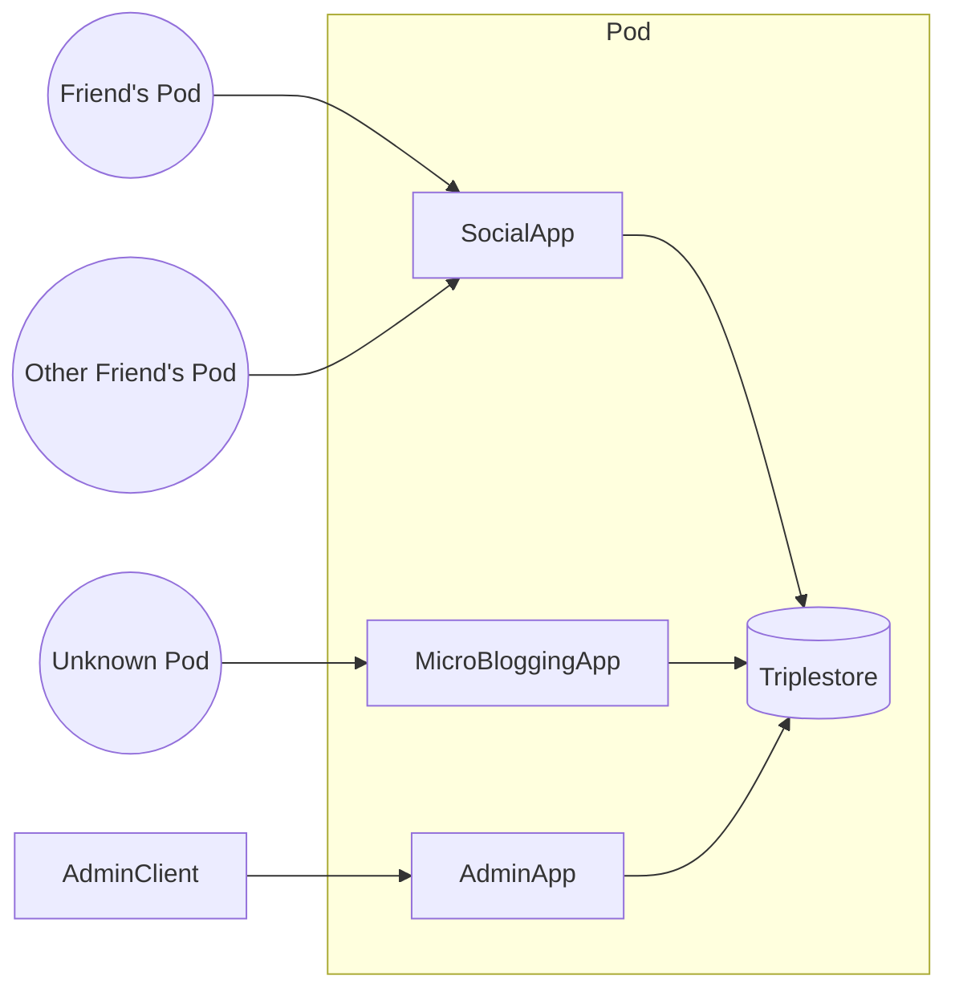
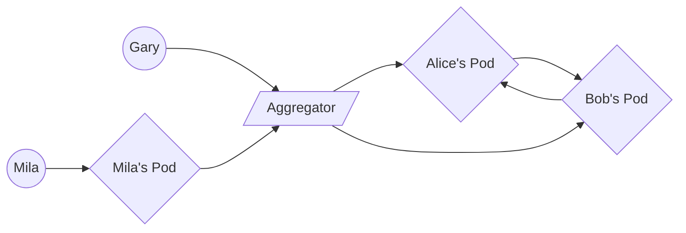

+++
title = "Lightning Klump"
outputs = ["Reveal"]
+++

### The Lingering Promise of the Semantic Web as a Modern Application Platform

Drake Talley

<small><i class="fab fa-github"></i>axylos</small> 
<small><i class="fab fa-twitter"></i> axylos</small>

---
### Who am I?

---

### What is the Semantic Web?

{}
A set of technologies intended to make internet data "machine-readable"
{}

{}
- A schema design language + serialization formats (RDF and friends)
- A query language with built-in logical inference capabilities (SPARQL)
- Set a of protocols to coordinate server-server interactions (Linked Data Protocol)
{}

---

### Unrealized Potential

{}
- Required high up-front design cost
- Full benefit only available in niche domains or alongside mass deployments
- Too little bang for the buck for early adopters
{}

---

### Centralization

---

### SaaS

{}
- There are many scenarios that require easy discovery from a large dataset or community followed by close interactions among a relatively very small cluster of actors.
{}

---

{}
SaaS businesses meet this need by enforcing a consistent data domain for all participants and centrally hosting that data alongside application servers
{}

{}
The rise of cloud computing lowered the cost of building new and focused services for addressing particular problems.
{}

---

### Where to go from here?

- Federated Services?
- Blockchain?

---
Contemporary Social Protocols
  - Solid
  - Trellis LDP
  - Activity Streams
  
---

### What are we trying to solve?

{}
A primary though underemphasized challenge is to expand access to highly available compute and network resources
{}

{}
We can correct the power imbalance between "client" users and server administrators by adjusting the technical comptency required to "own" a server to the same level as what is required to install and use a smartphone app.
{}

---

### A return to the Semantic Web (on the cloud)

{}
- Leverage RDF at the "edge" of p2p interactions
- "Glue" together data from disparate sources/apps via SPARQL
- Focus less on standards, more on building working prototypes that suit a particular need.
- Expose cloud-based server "pods" that communicate with each other via these channels
- QUIC as a transport layer

---

---

---

what it's like trying to adopt Semantic Web Tech

---

The root problem targeted by proposed "decentralized" schemes is accessible and reliable networked compute resources.

{}
this also holds for things like IPFS and other distributed data stores
since servers run the world, it seems we've tried to elevate a network of home PC's into a substrate for buildilng a new web.

this will not work.
{}

---

Cloud computing is the confluence of [the] four revolutions:

- The Internet
- Distributed Version Control
- Open Source
- Moore's Law

---

There is currently a bounty of "free" interesting software tools...

{}but they all are targeted towards developers {}

{}We should begin to design for anyone capable of downloading and using "apps" on a smart phone {}

{}
Cloud computing as a service allows web developers to forget about system administration and only focus on producing and deploying application-specific behavior

Users are plenty "technical"!  We as developers and product designers just need to prioritize that community as well.
{}

---

### A New Goal

Empower users with the ability and responsibility of managing their own cloud resources.

<small>
What if administering an application web server was as easy as installing and using a smartphone app?
</small>

{}
The division between user "client" software and "server administration" is largely artificial.  While it may have made sense in a particular set of circumstances, we should not treat this application design as immutable or unique
{}

---

# Mermaid Sample

