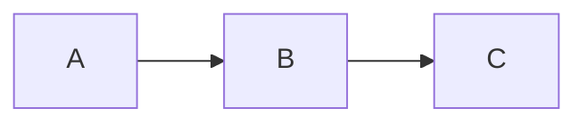

+++
title = "Lightning Klump"
outputs = ["Reveal"]
+++

### The Lingering Promise of the Semantic Web as a Modern Application Platform

Drake Talley

<small><i class="fab fa-github"></i> axylos</small> 
<small><i class="fab fa-twitter"></i> axylos</small>

---
### What was the goal of the Semantic Web?

to make internet data "machine-readable"

{}
I have a dream for the Web [in which computers] become capable of analyzing all the data on the Web – the content, links, and transactions between people and computers. A "Semantic Web", which makes this possible, has yet to emerge, but when it does, the day-to-day mechanisms of trade, bureaucracy and our daily lives will be handled by machines talking to machines. The "intelligent agents" people have touted for ages will finally materialize.
{}

---

# What is it?

A bundle of technologies and new standards extending WWW

- RDF + json/ld
- data stored in "triplestores" and exposed via a SPARQL endpoint or the linked data platform standards 
- HTTP API standards collectively termed the "Linked Data Platform"
- solidjs (contemporary project)

---

### And how's that going?

<blockquote>
The web of hypertext everybody knows about; the web of data hasn't really spread worldwide yet. So we're still working on it,""
</blockquote>

{}~Time Berners Lee{}
 
{}2006{}

{}
- things have gotten better
- but still not ready for primetime
{}
 
---

### Challenges

- complex technologies with a high learning curve
- RDF is a poor medium for expressing application logic
- difficult to adopt in mainstream application architectures

{}
- RDF is a work of art for uniting the varying usages of a serialization format, schema for application data, and an API specification.
- It's also terrible to try to directly manipulate and query in an application
- The impedance mismatch is much more severe than with SQL and OO design.
{}

---

what it's like trying to adopt Semantic Web Tech

{}
like yeah I could probably build something with that...maybe
{}

---

---

### Why does this matter now?

Aren't we all concerned about "decentralizing" a small number of incumbent web applications?

{}
- blockchain is too complicated, isn't really decentralized, and will never work
- gossip protocols have crude privacy and authorization controls
{}

---

The root problem targeted by proposed "decentralized" schemes is accessible and reliable networked compute resources.

{}
this also holds for things like IPFS and other distributed data stores
since servers run the world, it seems we've tried to elevate a network of home PC's into a substrate for buildilng a new web.

this will not work.
{}

---

Cloud computing is the confluence of [the] four revolutions:

- The Internet
- Distributed Version Control
- Open Source
- Moore's Law

---

There is currently a bounty of "free" interesting software tools...

{}but they all are targeted towards developers {}

{}We should begin to design for anyone capable of downloading and using "apps" on a smart phone {}

{}
Cloud computing as a service allows web developers to forget about system administration and only focus on producing and deploying application-specific behavior

Users are plenty "technical"!  We as developers and product designers just need to prioritize that community as well.
{}

---

### A New Goal

Empower users with the ability and responsibility of managing their own cloud resources.

<small>
What if administering an application web server was as easy as installing and using a smartphone app?
</small>

{}
The division between user "client" software and "server administration" is largely artificial.  While it may have made sense in a particular set of circumstances, we should not treat this application design as immutable or unique
{}

---

# Mermaid Sample

