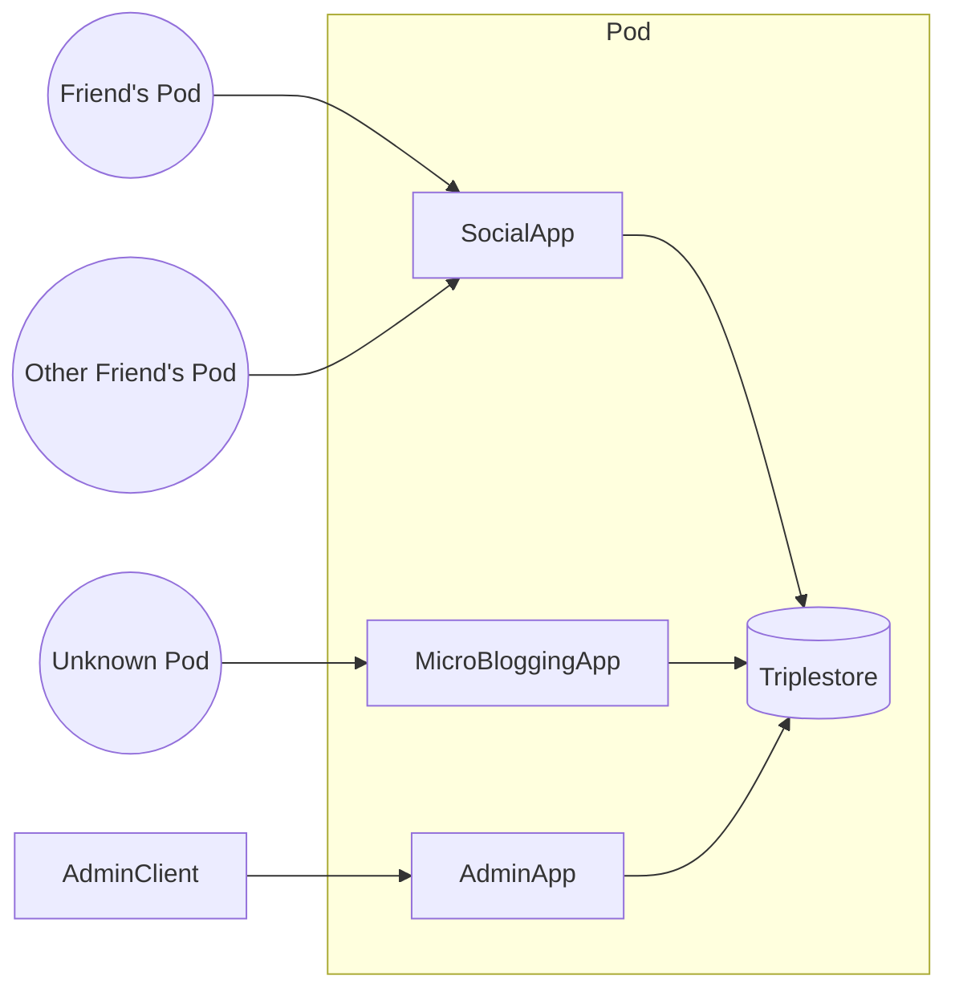
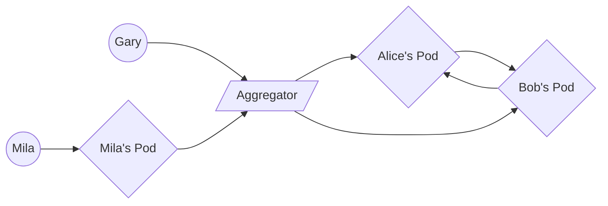

+++
title = "Lightning Klump"
outputs = ["Reveal"]
+++

### The Lingering Promise of the Semantic Web as a Modern Application Platform

Drake Talley

<small><i class="fab fa-github"></i>axylos</small> 
<small><i class="fab fa-twitter"></i> axylos</small>

---
### Who am I?

---

### What is the Semantic Web?

{}
A set of technologies intended to make internet data "machine-readable"
{}

---

- 
- 
- 

---

### Unrealized Potential (Historically)

{}
- Required high up-front design cost
- Full benefit only available in niche domains or with widespread adoption
- Too little bang for the buck for early adopters
{}

---

### SaaS

---

### Lessons to be Learned

Many Saas solutions enable low-effort discovery from massive datasets or communities followed by close interactions among a small group of participants.

---

### Ideas to Steal

{}
SaaS meets enforces a consistent data schema for all participants which makes it possible to build efficient and predictable user interfaces.
{}

{}
The rise of cloud computing lowered the cost of building new and focused services for addressing particular problems.
{}

---

### Where to go from here?

- Federated Services?
- Blockchain?

---
Contemporary Social Protocols
  - Solid
  - Trellis LDP
  - Activity Streams
  
---

### What are we trying to solve?

{}
A great deal of indirect attention is being directed to the under-appreciated problem of expanding access to cheap compute resources with highly reliable network connectivity.
{}

{}
We can correct the power imbalance between "client" users and server administrators by adjusting the technical comptency required to "own" a server to the same level as what is required to install and use a smartphone app.
{}

---

### A return to the Semantic Web (on the cloud)

{}
- Leverage RDF at the "edge" of p2p interactions
- "Glue" together data from disparate sources/apps via SPARQL
- Focus less on standards, more on building working prototypes that suit a particular need.
- Expose cloud-based server "pods" that communicate with each other via these channels
- QUIC as a transport layer
{}

---

### Why cloud-backed p2p?

- Fine-grained and tweakable access controls
- Very cheap to handle more computationally intensive tasks
- All of a user's data across domains in one place and queryable

---

---

---

what it's like trying to adopt Semantic Web Tech

---

