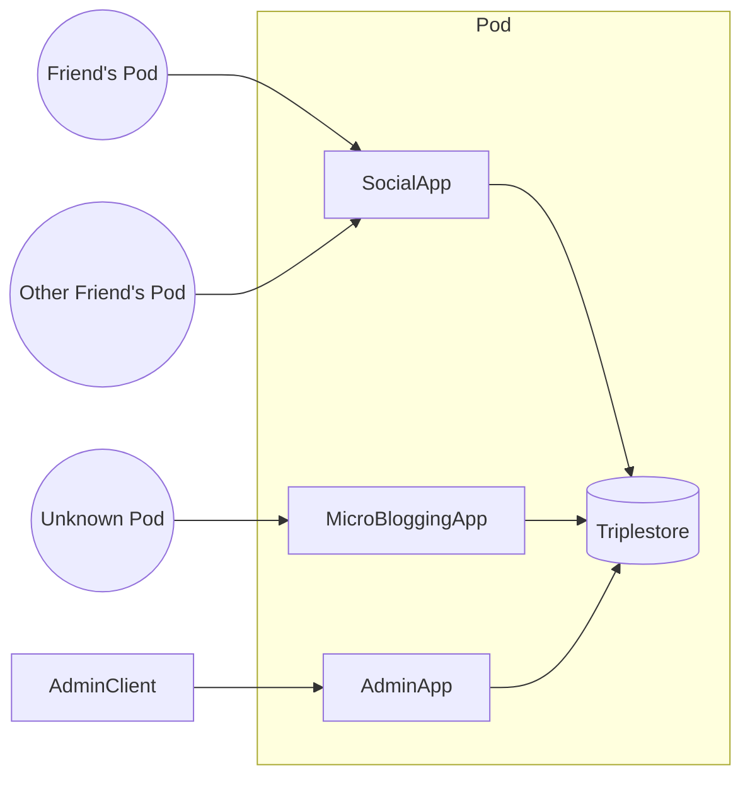
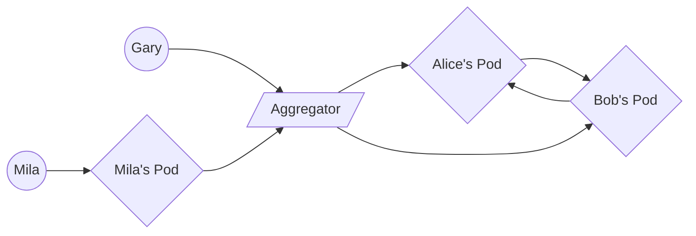

+++
title = "Lightning Klump"
outputs = ["Reveal"]
+++

### The Lingering Promise of the Semantic Web as a Modern Application Platform

Drake Talley

<small><i class="fab fa-github"></i>axylos</small><br />
<small><i class="fab fa-twitter"></i> axylos</small>

---
### Who am I?

---

### What is the Semantic Web?

A set of technologies intended to make internet data "machine-readable"

---

### RDF (and friends)

A homoiconic schema design language for rich data models tightly integrated with DNS, leveraging IRI's as primive terms.

```
@prefix rdf: <http://www.w3.org/1999/02/22-rdf-syntax-ns#> .
@prefix dc: <http://purl.org/dc/elements/1.1/> .
@prefix ex: <http://example.org/stuff/1.0/> .

<http://www.w3.org/TR/rdf-syntax-grammar>
  dc:title "RDF/XML Syntax Specification (Revised)" ;
  ex:editor [
    ex:fullname "Dave Beckett";
    ex:homePage <http://purl.org/net/dajobe/>
  ] .
```
--- 
Within RDF all of the below are first-class concepts expressible with the same syntax+grammer.
- Schema types (User, Post) and relationship definitions (has-one, belongs-to)
- Concrete resources and their related resources
- Logical inference relations which enable rich schematic translations (sub-class of, same-as, etc.)

---

### SPARQL

- Query engine with built-in inference reasoner
- Originally intended for federated queries across disparate data sources
- Higher level logical entailments great for extracting subtle features from complex data sets, but is too expensive and overkill for typical app development.

---

### What it's like trying to adopt Semantic Web Tech


---

### Unrealized Potential (Historically)

- Required high up-front design cost
- RDF is difficult to work with as an application model
- Did not offer a compelling value-add for most pressing user needs
- Too little bang for the buck for early adopters

---

### SaaS


---

### Lessons to be Learned

- Many Saas solutions enable low-effort discovery from massive datasets or communities followed by close interactions among a small group of participants.

- The SaaS model enforces a consistent data schema for all participants which makes it possible to build efficient and predictable user interfaces.

- Innovations in cloud compute offerings significantly lowered the cost of building new services for addressing domain-specific problems.
---

### Where to go from here?

- Federated Services?
- Blockchain?
- Gossip Protocols (SSB)?
- Contemporary SW Tech?
  - Solid
  - Trellis LDP
  - Social Protocols
---

### What are we trying to solve?

{}
A common thread is the attempt to expand access to cheap and reliable compute resources with highly available network connectivity.
{}

{}
We can correct the power imbalance between "client" users and server administrators by adjusting the technical threshold for "owning" a server to the same level as what is required to install and use a smartphone app.
{}

---

### A return to the Semantic Web on the cloud

(via a p2p topology)

---

- Expose cloud-based server "pods" that communicate with each other and expose web UI's for humans
  - handle domain specific operations with installable "apps".
- Leverage RDF at the "edge" of p2p interactions (an in-app ORM layer would help here)
- "Glue" together data from disparate sources/apps via SPARQL
  - This also solves the schema evolution problem
- Use QUIC as a transport layer rather than Linked Data Platform or HTTP Social Web protocols

---

### Why cloud-based p2p?

- Fine-grained and tweakable access controls
- Very cheap to handle more computationally intensive tasks
- All of a user's data across domains in one place and queryable

---



---


---

# FIN
